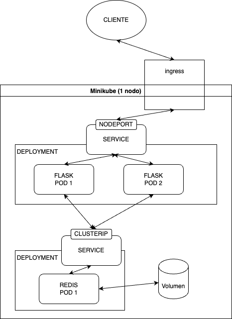
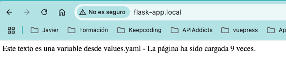

# PRÁCTICA CONTENEDORES: MÁS QUE VMS KUBERNETES - JUAN ARILLO

Práctica de Juan Arillo para el módulo de **Contenedores: Más que VMs Kubernetes** a la nube.

## TABLA DE CONTENIDOS

[Descripción](#descripción)  
[Requisitos](#requisitos)  
[Pasos previos](#pasos-previos)
[Funcionamiento](#funcionamiento)

## DESCRIPCIÓN

Este proyecto despliega en Kubernetes una aplicación *Flask* que trabaja sobre una base de datos *Redis*.  

La aplicación *Flask* muestra un texto que proviene del fichero `values.yaml` de la configuración del chart de Helm, más un texto que muestra las veces que se ha cargado la página principal de la aplicación. La imagen de la aplicación *Flask* está en un repositorio personal de docker hub ([*Docker hub*](https://hub.docker.com/repository/docker/juanarillo/docker_practica/general)).

El servicio de la base de datos *Redis*, sirve como persistencia del número de veces que se visita la página principal
de la aplicación.

Su arquitectura sería de este tipo  

<p align="center">
    
</p>

## REQUISITOS

Para poder desplegar este proyecto, serán necesarias las siguientes herramientas:

- *Minikube* -> Cluster local de Kubernetes para desarrollo y pruebas ([*Minikube*](https://minikube.sigs.k8s.io/docs/start/?arch=%2Fmacos%2Farm64%2Fstable%2Fbinary+download)).
- *Kubectl* -> Interacción con los clústeres Kubernetes ([*Kubectl*](https://kubernetes.io/docs/tasks/tools/)).
- *Helm* -> Gestor de paquetes para Kubernetes ([*Helm*](https://helm.sh/docs/intro/install/)).

## PASOS PREVIOS

1- Descarga del proyecto desde el repositorio de *Github*.

```bash
git clone https://github.com/KeepCodingCloudDevops11/juanarillo_kubernetes_practica.git
```

2- Arranque de minikube

```bash
minikube start
```

3- Instalación del addon de ingress para minikube

```bash
minikube addons enable ingress
```

## DESPLIEGUE

- Nos situaremos dentro de la carpeta del proyecto.

```bash
cd juanarillo_kubernetes_practica
```

- Una vez en la carpeta, desplegaremos la aplicación usando *Helm*

```bash
helm install flask-app .

# Donde flask-app es el nombre que queramos darle a la release.
```

- Para poder ver la aplicación funcionando en el navegador, tendremos que hacer dos cosas:   

  - Al no tener dns, habrá que reflejar el host establecido en el fichero `values.yaml` para ingress > host, en el fichero hosts del ordenador local:

    ```bash
    sudo nano /etc/hosts
    ```

    ```txt
    # Añadimos en el fichero hosts el nombre que hayamos establecido en
    # el fichero values.yaml, en la sección ingress > host
    127.0.0.1    flask-app.local
    ```

  - Arrancamos el tunel de minikube para poder usar el ingress.  

    ```bash
    minikube tunnel
    ```

## FUNCIONAMIENTO

Una vez desplegado el cluster, y configurado el ordenador local, se puede abrir al navegador y acceder usando la url establecido en el host (http://flask-app.local si no se modifica el `values.yaml`).  

La aplicación debe mostrar un texto variable al principio (establecido en el fichero `values.yaml` en flask > message), y un texto con el numero de veces que se ha recargado la página. Este contador aumentará cada vez que se recargue la misma.

<p align="center">
    
</p>

[Ver el video](/images/demo.mov)

<p align="center">
    <video width="600" controls align="center">
    <source src="images/demo.mov" type="video/quicktime">
    Your browser does not support the video tag.
    </video>
</p>